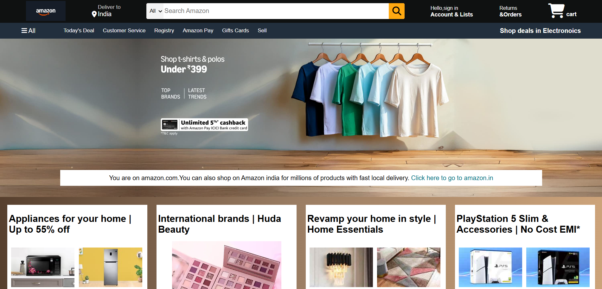

# Amazon Clone (HTML & CSS)

A responsive Amazon homepage clone built using HTML and CSS.

## Features
- Responsive Navigation Bar
- Search Bar UI
- Hero Banner
- Product Cards
- Footer Section
- Clean and Responsive Design

## Technologies Used
- HTML5
- CSS3

## 📸 Project Preview
This project replicates the Amazon homepage for frontend practice and UI development.

## Author
Kavya Tyagi
